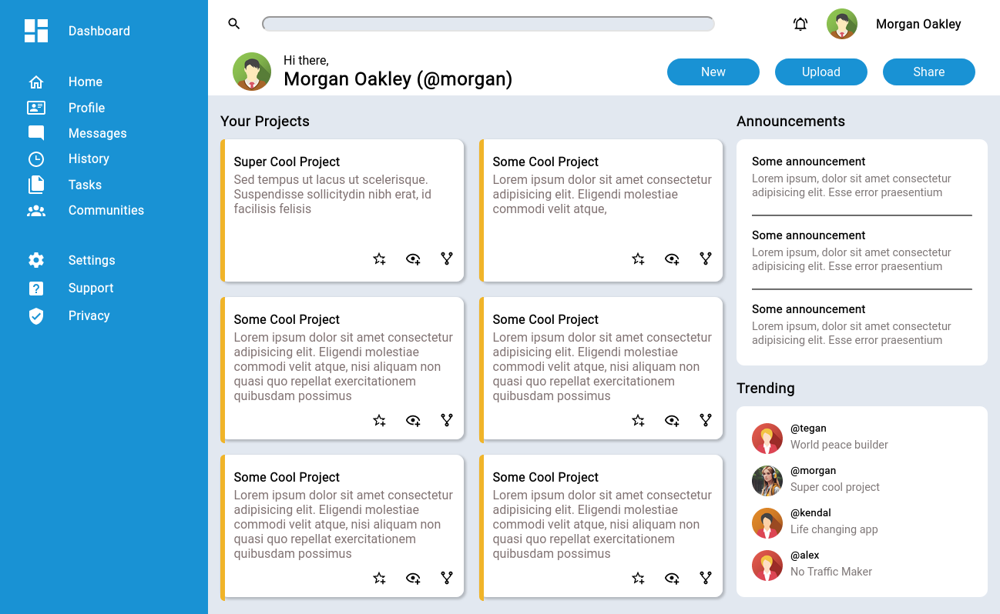

# Admin Dashboard Layout

A desktop layout for an admin dashboard.

[Link to Project Description on The Odin Project](https://www.theodinproject.com/lessons/node-path-intermediate-html-and-css-admin-dashboard)

## Live Preview

[Live Preview](https://tonyfred-code.github.io/project-admin-dashboard/)

## Usage

This project features the desktop layout for an admin dashboard, showcasing your skills in designing and structuring web pages for admin panels.

## Technologies Used

- HTML and CSS for layout and styling.

## License

This project is licensed under the [MIT License](LICENSE).

## Acknowledgments

 [MDN Devdocs](https://devdocs.io/) was very useful.
 Icons from [Material Design Icons](https://pictogrammers.com/library/mdi/)